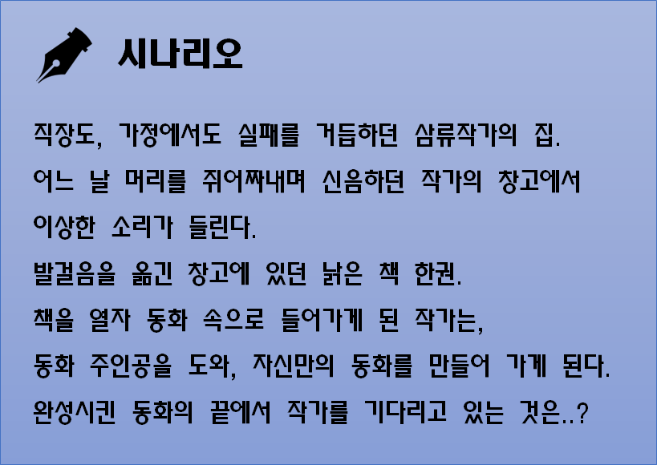
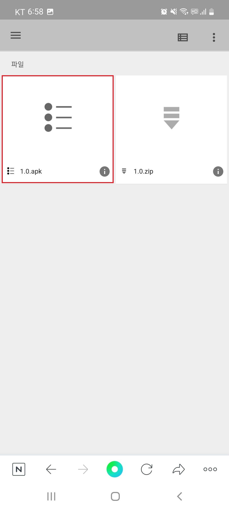

# 2022 캡스톤 디자인 46팀

**github 주소** -> <a href = "https://github.com/kookmin-sw/capstone-2022-46" target="_blank" >https://github.com/kookmin-sw/capstone-2022-46 </a>

---------------------------------------

## 1. 프로잭트 소개

### 2D 종스크롤 슈팅 게임 - Tall Tales
 - 높아지는 그래픽과, 사양이 주류가 된 최근의 게임 시장에서  
   간단한 2D 도트 게임이지만 큰 인기를 끈 '뱀파이어 서바이벌' 이라는 게임이 있었다.   
   이 게임을 보면서 왜 유저들이 이런 간단한 게임에 열광했는지에 대해 생각해 보게 되었고,   
   '간단하게 즐길수 있다', '캐릭터를 성장시키는 재미가 있다' 라는 두가지 요소에 주목하게 되었다.  
   이를 통해 바쁜 현대인들이, 간단하게 즐길수 있으면서도, 강한 중독성으로 계속해서  
   플레이를 할 수 있는 게임을 만들어 보고싶다는 생각을 하게 되었다.

### Abstract
- In this recent trend of higher graphical games, there was a game with relatively simple graphics and made a big influence, ‘Vampire Survivors’. 
  In this game, our team imagined “What made people go wild on such a simple game?” and came up with two reasons. ‘simplicity’, and ‘character growth’. 
  So we made a catchy game with short playtime for busy people.

---------------------------------------
---------------------------------------
## 2. 게임 소개

  &nbsp;&nbsp;&nbsp; 

  &nbsp;&nbsp;&nbsp; 

---------------------------------------
**게임 플레이**

   

 - 동화의 주인공이 되어 위에서 몰려오는 적을 피하고 공격하며
   자신만의 모험을 하게 됩니다.

---------------------------------------

**소개 동영상**

---------------------------------------
## 3. 팀 소개

### 팀원
* 20163165 최민혁
  + 담당  : 적, 보스 패턴 개발, 게임 스테이지 개발
  + Email : 
  
* 20163168 최원준
  + 담당  : 캐릭터, 아이템 ,UI 및 디자인
  + Email : hhh9597h@naver.com

---------------------------------------
---------------------------------------
## 4. 게임 이용법

* 모바일
1. 휴대폰으로 qr 코드를 찍는다.

 

2. 빨간부분의 링크를 클릭

 

3. apk파일을 다운로드 한뒤, 설치해준다.

 

* PC
1. <a href = "https://drive.google.com/drive/folders/1OR1tDDwOOTWIwYRjiQkRpPMxiIbgLDZV?usp=sharing" target="_blank" >https://drive.google.com/drive/folders/1OR1tDDwOOTWIwYRjiQkRpPMxiIbgLDZV?usp=sharing </a>  링크로 구글 드라이브에 접속한다
2. PC라는 이름의 파일을 내려받고 압축을 해제한다.
 
3. Tall Tales 아이콘을 클릭해 실행한다.

---------------------------------------
---------------------------------------

## 5. 기타

차후추가.
